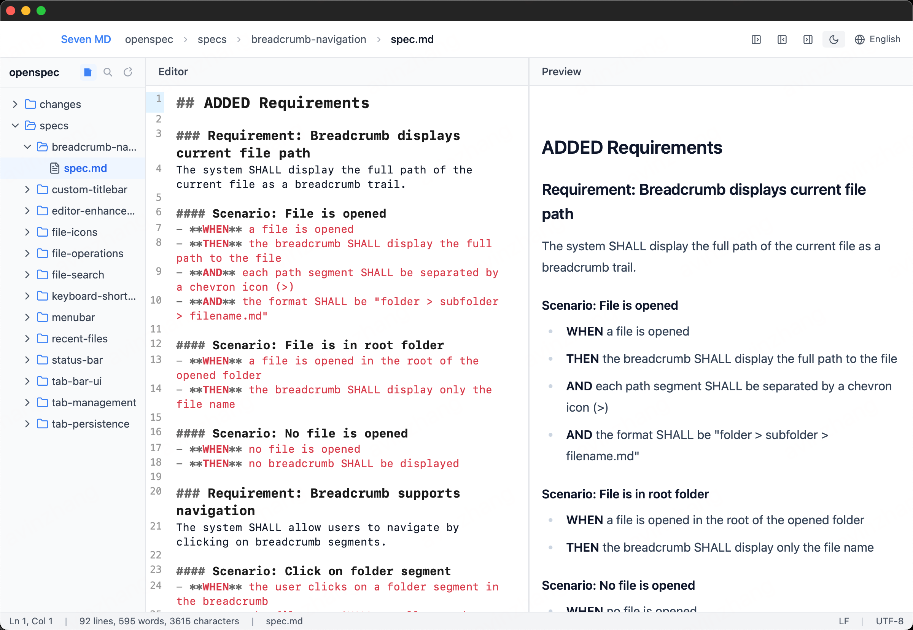
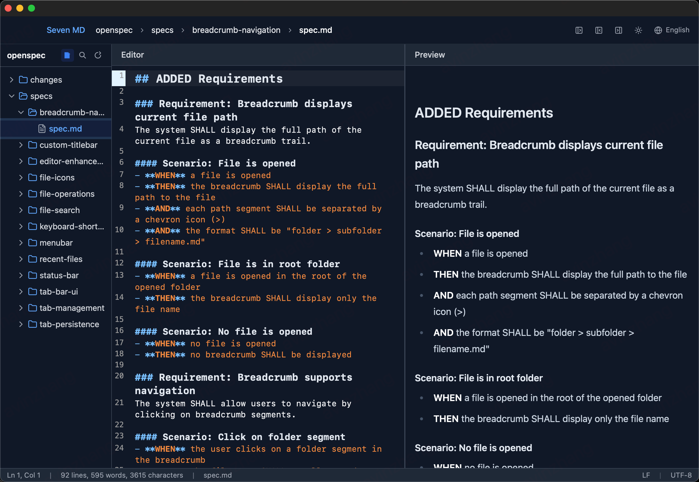

# Seven MD - 跨平台 Markdown 编辑器

<div align="center">


**一个现代化的 Markdown 编辑器，支持 macOS 和 Windows**

[](https://opensource.org/licenses/MIT)
[](https://github.com/qwzhang01/seven_md)

</div>

---

## ✨ 功能特性

### 编辑器
- 📝 **CodeMirror 6 编辑器** - 专业级代码编辑体验，支持语法高亮、括号匹配、自动配对
- 📋 **列表自动续行** - Markdown 列表自动续行，空行退出
- 🔍 **查找替换** - 支持大小写敏感、全字匹配、正则表达式
- 🎯 **多标签页** - 多文件编辑，拖拽排序，关闭恢复

### 预览
- 📊 **实时预览** - 左右分栏实时渲染 Markdown
- ✅ **GFM 支持** - GitHub Flavored Markdown 完整支持
- 📐 **数学公式** - KaTeX 渲染数学公式
- 🎨 **代码高亮** - 多语言代码语法高亮

### 界面
- 🎨 **7 种主题** - 包含亮色/暗色/蓝调/紫调等主题，一键切换
- 📁 **资源管理器** - 侧边栏文件树浏览，快速导航
- 📑 **大纲视图** - 文档结构大纲，快速跳转
- 🔖 **代码片段** - 常用 Markdown 片段快速插入
- 💬 **命令面板** - Ctrl+Shift+P 快速执行命令
- 🤖 **AI 助手** - 内置 AI 面板，支持对话和改写模式

### 平台
- 🖥️ **跨平台** - 原生支持 macOS 和 Windows
- 📱 **响应式布局** - 适配不同窗口尺寸
- 🌙 **原生集成** - 平台原生菜单和窗口控制
- 🔒 **本地运行** - 纯本地应用，无网络依赖，保护隐私

## 📸 截图

<div align="center">


</div>

## 🚀 快速开始

### 前置要求

- **Node.js** 18+
- **Rust** 1.70+

### 安装与运行

```bash
# 克隆仓库
git clone https://github.com/qwzhang01/seven_md.git
cd seven_md

# 安装依赖
npm install

# 开发模式运行
npm run tauri:dev
```

### 构建

```bash
# 构建生产版本
npm run tauri:build
```

构建产物位于 `src-tauri/target/release/bundle/` 目录。

## 🛠️ 技术栈

| 技术 | 说明 |
|------|------|
| **Tauri v2** | Rust 后端，提供原生桌面能力 |
| **React 19** | 现代化的前端框架 |
| **TypeScript** | 类型安全 |
| **Vite** | 快速的开发构建工具 |
| **Tailwind CSS** | 实用优先的 CSS 框架 |
| **CodeMirror 6** | 专业级代码编辑器 |
| **Zustand** | 轻量级状态管理 |
| **ReactMarkdown** | Markdown 渲染引擎 |

## 📁 项目结构

```
seven_md/
├── src/                        # 前端源代码
│   ├── components/             # React 组件
│   │   ├── titlebar-v2/       # 自定义标题栏（交通灯 + 标签页）
│   │   ├── menubar-v2/        # 菜单栏（7 大菜单）
│   │   ├── toolbar-v2/        # 工具栏
│   │   ├── activitybar-v2/    # 活动栏
│   │   ├── sidebar-v2/        # 侧边栏（资源管理器/搜索/大纲/片段）
│   │   ├── editor-v2/         # 编辑器 + 预览 + 右键菜单 + 查找替换
│   │   ├── ai-panel/          # AI 助手面板
│   │   ├── cmd-palette/       # 命令面板
│   │   ├── notification-v2/   # 通知系统
│   │   ├── modal-v2/          # 模态对话框
│   │   └── statusbar-v2/      # 状态栏
│   ├── stores/                 # Zustand 状态管理
│   ├── commands/               # 命令系统
│   ├── styles/                 # 主题和样式
│   ├── AppV2.tsx               # 主应用组件（V2）
│   └── main.tsx                # 应用入口
├── src-tauri/                  # Rust 后端
├── e2e/                        # Playwright E2E 测试
├── docs/                       # 文档
└── openspec/                   # OpenSpec 设计规范
```

## ⌨️ 快捷键

| 快捷键 | 功能 |
|--------|------|
| `Ctrl+Shift+P` | 命令面板 |
| `Ctrl+F` | 查找 |
| `Ctrl+H` | 查找替换 |
| `Ctrl+S` | 保存文件 |
| `Ctrl+N` | 新建文件 |
| `Ctrl+O` | 打开文件 |
| `Ctrl+B` | 加粗 |
| `Ctrl+I` | 斜体 |
| `Ctrl+Shift+M` | AI 助手 |
| `Ctrl+\`` | 切换侧边栏 |

## 📄 许可证

本项目采用 [MIT License](LICENSE) 开源协议。

## 🙏 致谢

- [Tauri](https://tauri.app/) - 构建更小、更快、更安全的桌面应用
- [React](https://react.dev/) - 用于构建用户界面的 JavaScript 库
- [CodeMirror](https://codemirror.net/) - 可扩展的代码编辑器
- [Zustand](https://github.com/pmndrs/zustand) - 简洁的 React 状态管理
- [Tailwind CSS](https://tailwindcss.com/) - 实用优先的 CSS 框架
