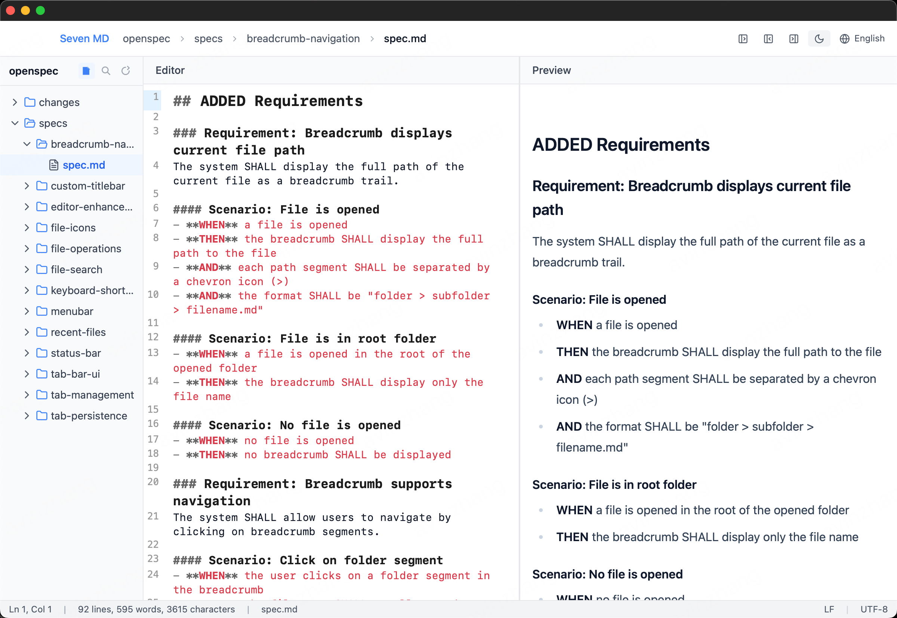
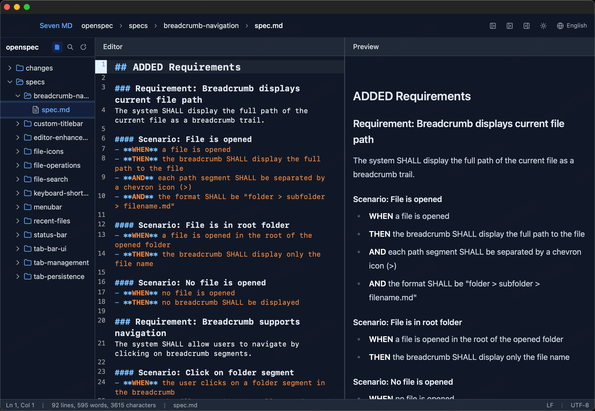

# Seven Markdown — AI 时代的 Markdown 写作工作站

<div align="center">


**Write Markdown Like Code**

[](https://github.com/qwzhang01/seven_md/releases)
[](https://opensource.org/licenses/MIT)
[](https://github.com/qwzhang01/seven_md)
[](https://tauri.app/)
[](https://react.dev/)
[](https://www.typescriptlang.org/)

</div>

---

## 💡 愿景与背景

> **编程有太多好用的 AI Agent，写文章也可以有。**

在编程领域，我们已经有了许多优秀的 AI Agent：

- **Claude Code** — Anthropic 出品的强大编程助手
- **GitHub Copilot** — 全球最流行的 AI 编程助手
- **Cursor** — 专为 AI 编程打造的编辑器
- **OpenCode** — 开源的 AI 编程工具

**但写文章呢？尤其是用 Markdown 写文章？**

这是我的第一个尝试 —— **Seven Markdown**。

它不仅仅是一个 Markdown 编辑器，更是一个 **AI 时代的写作工作站**：

- 内置 AI 对话、改写、翻译、解释能力
- 专为写作场景优化的编辑器体验
- 像代码编辑器一样的高效操作（VS Code 风格交互）
- 已集成 **Pi AI/Agent** 框架，打造写作 / 研究报告的 **AI IDE**

### 更大的愿景

Seven Markdown 只是开始。我相信**每个专业领域都可以有自己的 AI Agent**：

- 📝 **Seven Markdown** — 写作 Agent（当前项目）
- 👥 **HR Agent** — 简历筛选、面试安排、绩效评估
- 💰 **财务 Agent** — 报表分析、预算编制、税务合规
- 📊 **数据分析 Agent** — 数据清洗、可视化、报告生成
- ⚖️ **法律 Agent** — 合同审查、法规查询、案例分析

未来可期，一起探索 🚀

> 📋 想了解更多规划细节？参阅 [docs/FUTURE_TODO.md](docs/FUTURE_TODO.md) — 完整路线图（含 Git 集成、Pi Agent 增强等）

---

## 📸 截图

<div align="center">


</div>

<div align="center">

</div>

---

## ✨ 功能特性

### 🖋️ 编辑器
- **CodeMirror 6** — 专业级编辑体验，Markdown 语法高亮、括号匹配、自动配对
- **行号 + 当前行高亮** — 点击行号选中整行
- **列表自动续行** — 列表回车自动续行，空行退出
- **Tab 缩进** — `Tab` / `Shift+Tab` 控制缩进层级
- **自动换行切换** — 支持开启/关闭自动换行
- **查找替换** — 支持大小写敏感、全字匹配、正则表达式，显示匹配计数
- **多标签页** — 多文件编辑，拖拽排序，未保存标记，标签右键菜单（关闭、关闭其他、关闭左侧、关闭右侧、复制路径等）
- **右键菜单** — 剪切/复制/粘贴 + 插入子菜单（标题/代码/链接/表格/列表/引用等，hover 展开）+ AI 改写

### 👀 预览
- **实时预览** — 编辑器与预览左右分栏，实时同步渲染
- **滚动同步** — 编辑器与预览区域滚动位置同步
- **GFM 支持** — GitHub Flavored Markdown（表格、任务列表、删除线）
- **数学公式** — KaTeX 渲染 LaTeX 数学公式
- **代码高亮** — highlight.js 多语言语法高亮
- **Mermaid 图表** — 原生渲染流程图、时序图、甘特图等
- **链接智能导航** — 内部 `.md` 链接在新标签页打开，外部链接调用系统浏览器，`#` 锚点链接平滑滚动
- **3 种视图模式** — 分栏视图 / 仅编辑器 / 仅预览，可拖拽分隔条调整比例

### 🎨 界面
- **7 种主题** — Dark（默认）/ Light / Monokai / Solarized / Nord / Dracula / GitHub
- **Tauri 原生菜单** — 文件 / 编辑 / 视图 / 插入 / 格式 / 主题 / 帮助（含窗口菜单），完整 macOS & Windows 原生体验
- **完整工具栏** — 撤销/重做 | H1-H3 | 加粗/斜体/删除线 | 代码/代码块 | 链接/图片 | 列表组 | 引用/表格/水平线 | 视图切换 | 命令面板 | AI
- **资源管理器** — VS Code 风格文件树，支持展开/折叠/新建/刷新/拖拽移动，文件与文件夹均有标准右键菜单（含在终端中打开、在 Finder 中显示）
- **全局搜索** — 跨文件实时搜索，支持文件名搜索和全文搜索双模式，正则、大小写、全字匹配
- **大纲视图** — H1-H6 标题层级导航，不同级别使用不同颜色区分，支持筛选与跳转
- **代码片段** — 表格/代码块/任务列表/Mermaid/PRD 模板/API 文档模板等一键插入
- **命令面板** — `Ctrl+Shift+P` 统一命令入口，模糊搜索
- **AI 助手** — 对话模式 + Agent 模式（自主读写文档、工具调用、diff 预览与一键应用、会话管理、预设模板）；改写（专业·随意·简洁·扩展）/ 翻译（中↔英·中→日）/ 解释
- **通知系统** — info / warning / error / success 4 种类型，hover 暂停计时，自动消失，最大堆叠限制
- **多窗口** — `Ctrl+Shift+N` 新建独立窗口，每个窗口可绑定独立工作文件夹，窗口间状态隔离
- **在新窗口中打开文件夹** — 通过菜单选择文件夹并在新窗口中直接打开
- **最近文档** — 原生系统最近文件列表集成，快速重新打开
- **状态栏** — 光标位置、字数统计、编码、换行符、Git 分支（自动轮询）、滚动同步开关、通知、缩放级别
- **微信公众号导出** — Markdown 转内联样式 HTML，支持 3 种内置主题（经典/优雅/简洁），主色自定义，实时预览，一键复制到剪贴板

### 🌐 国际化
- **中英双语** — i18next 多语言框架，支持 中文 / English 完整翻译，浏览器语言自动检测
- **RTL 支持** — 自动识别 RTL 语言并设置文档方向

### ♿ 无障碍 & 质量
- **无障碍合规** — ARIA 标签、角色、键盘导航、焦点指示器、减少动效支持
- **性能监控** — 内存使用监控，防止内存泄漏
- **安全可靠** — CSP 防护、沙箱文件访问、输入验证与净化
- **错误边界** — React ErrorBoundary 优雅降级，防止白屏崩溃

### 🖥️ 平台
- **跨平台** — 原生支持 macOS 和 Windows
- **响应式布局** — 桌面端完整布局，小窗口自动适配，移动端侧边栏覆盖层
- **原生集成** — macOS 交通灯、Tauri 原生菜单、窗口控制
- **本地运行** — 纯本地应用，无网络依赖（AI 功能需网络），保护隐私

---

## 🚀 快速开始

### 前置要求

- **Node.js** ≥ 18
- **npm** ≥ 9
- **Rust** ≥ 1.70
- **平台依赖**：
  - macOS — Xcode Command Line Tools
  - Windows — Microsoft Visual Studio C++ 生成工具、WebView2

### 安装与运行

```bash
# 克隆仓库
git clone https://github.com/qwzhang01/seven_md.git
cd seven_md

# 安装依赖
npm install

# 开发模式运行（启动 Tauri 桌面应用）
npm run tauri:dev
```

### 构建

```bash
# 构建生产版本
npm run tauri:build
```

构建产物位于 `src-tauri/target/release/bundle/`。

### 常用命令

| 命令 | 说明 |
|------|------|
| `npm run dev` | 仅前端开发服务器 |
| `npm run tauri:dev` | Tauri 开发模式（含 Rust 后端） |
| `npm run tauri:build` | 生产构建 |
| `npm run test` | Vitest 监听模式 |
| `npm run test:run` | 运行单元/集成测试 |
| `npm run test:coverage` | 测试覆盖率报告 |
| `npm run test:e2e` | Playwright E2E 测试 |
| `npm run lint` | ESLint 代码检查 |
| `npm run type-check` | TypeScript 类型检查 |
| `npm run format` | Prettier 代码格式化 |

---

## 🛠️ 技术栈

| 层 | 技术 | 说明 |
|----|------|------|
| **运行时** | Tauri v2 | Rust 后端，原生桌面能力（窗口管理、文件系统、原生菜单） |
| **UI 框架** | React 19 + TypeScript 5 | 类型安全的组件化开发 |
| **构建工具** | Vite 5 | 快速的开发服务器与生产构建 |
| **样式** | Tailwind CSS 3 | 实用优先的样式框架，支持 CSS 变量主题 |
| **编辑器** | CodeMirror 6 | 专业级 Markdown 编辑器引擎 |
| **状态管理** | Zustand 5 | 轻量级 Store（10 个业务 Store） |
| **Markdown 解析** | marked + react-markdown | 双引擎（marked 用于导出，react-markdown 用于预览渲染） |
| **GFM 扩展** | remark-gfm | 表格、任务列表、删除线 |
| **数学公式** | remark-math + rehype-katex | LaTeX 公式渲染 |
| **代码高亮** | highlight.js + rehype-highlight | 多语言语法高亮 |
| **图表渲染** | Mermaid 10 | 流程图、时序图、甘特图等 |
| **图标** | Lucide React | 精美的开源图标库 |
| **国际化** | i18next + react-i18next | 多语言支持框架，含浏览器语言自动检测 |
| **AI 引擎** | Pi AI/Agent（vendor） | 内嵌 AI 框架，支持流式输出、上下文压缩、内存会话管理 |
| **微信导出** | juice | CSS 内联化工具，用于微信公众号样式导出 |
| **测试** | Vitest + Playwright | 单元/集成测试 + E2E 测试 |
| **代码规范** | ESLint 8 + Prettier + commitlint | 代码质量与提交规范 |

---

## 📁 项目结构

```
seven_md/
├── src/                        # 前端源代码
│   ├── components/             # React 组件
│   │   ├── titlebar/           # 标题栏（标签页 + 拖拽排序 + 右键菜单）
│   │   ├── toolbar/            # 工具栏（格式按钮组 + 视图切换 + AI 入口）
│   │   ├── activitybar/        # 活动栏（图标切换侧边栏面板）
│   │   ├── sidebar/            # 侧边栏（资源管理器/搜索/大纲/片段）
│   │   ├── editor/             # 编辑器 + 预览 + 分隔条 + 右键菜单 + 查找替换 + Mermaid
│   │   ├── ai-panel/           # AI 助手（对话/Agent/改写/翻译/解释 + 会话管理 + Diff 预览）
│   │   ├── cmd-palette/        # 命令面板
│   │   ├── notification/       # 通知系统（4 种类型，hover 暂停）
│   │   ├── modal/              # 模态对话框（确认/脏文件提示）
│   │   ├── dialogs/            # 业务对话框（欢迎页/快捷键参考/关于）
│   │   ├── shared/             # 共享组件（通用右键菜单）
│   │   ├── statusbar/          # 状态栏
│   │   └── ErrorBoundary/      # 错误边界
│   ├── stores/                 # Zustand 状态管理（10 个 Store）
│   ├── commands/               # 命令注册与执行
│   ├── hooks/                  # 自定义 Hooks（文件操作/快捷键/搜索/主题/导出/无障碍等）
│   ├── lib/                    # 第三方库 vendor 源码
│   │   ├── pi/                 # Pi AI/Agent 框架（vendor）
│   │   │   ├── ai/             # Pi AI 引擎（stream / complete / providers）
│   │   │   └── agent/          # Pi Agent 运行时（Agent 类 / agentLoop / compaction / session）
│   │   └── eventBus.ts         # 事件总线（解耦组件通信）
│   ├── services/               # 业务服务层
│   │   └── ai/                 # AI 服务封装（对话 + Agent 应用层）
│   │       ├── agent/          # Markdown Agent 工具适配层（toolRegistry / markdownAgent 等）
│   │       └── providers/      # Provider 配置（桥接 Pi 原生与 OpenAI Compatible）
│   ├── wechat/                 # 微信公众号导出模块（主题编辑 + 实时预览 + 导出）
│   ├── utils/                  # 工具函数（日志/路径验证/导出/安全/性能监控/链接导航/最近文档等）
│   ├── styles/                 # 全局样式（主题 CSS / 无障碍 / RTL / 焦点指示器）
│   ├── themes/                 # 主题定义（7 种主题配色）
│   ├── types/                  # TypeScript 类型定义
│   ├── i18n/                   # 国际化配置（中英文翻译）
│   ├── test/                   # 单元/集成测试
│   ├── App.tsx                 # 主应用组件（注册 Tauri 菜单事件）
│   ├── main.tsx                # 入口文件
│   └── tauriCommands.ts        # Tauri IPC 命令封装
├── src-tauri/                  # Rust 后端
│   └── src/
│       ├── main.rs             # 应用入口 + Tauri 原生菜单定义 + 插件注册
│       ├── menu.rs             # 原生菜单构建与事件分发
│       ├── commands/           # Tauri IPC 命令模块
│       │   ├── mod.rs          # 模块入口
│       │   ├── fs.rs           # 文件系统操作（读写/目录/增删改/监听）
│       │   └── system.rs       # 系统命令（Git/日志/HTML导出/搜索/多窗口/终端）
│       └── logger.rs           # 日志模块
├── e2e/                        # Playwright E2E 测试（Page Object Model）
├── test/                       # Rust 后端测试
└── docs/                       # 项目文档（含 FUTURE_TODO.md 路线图）
```

> **架构说明**：菜单栏由 **Tauri 原生菜单** 实现（`src-tauri/src/menu.rs`），前端通过监听菜单事件响应用户操作（`App.tsx`），因此 `src/components/` 下不存在前端 MenuBar 组件。

---

## ⌨️ 快捷键

> 以下使用 `Ctrl` 占位；macOS 上等同于 `Cmd`。

### 文件操作

| 快捷键 | 功能 |
|--------|------|
| `Ctrl+N` | 新建文件 |
| `Ctrl+Shift+N` | 新建窗口 |
| `Ctrl+O` | 打开文件 |
| `Ctrl+S` | 保存 |
| `Ctrl+Alt+S` | 全部保存 |
| `Ctrl+Shift+S` | 另存为 |
| `Ctrl+W` | 关闭标签 |
| `Ctrl+Q` | 退出（macOS 下为 `Cmd+Q`） |

### 编辑

| 快捷键 | 功能 |
|--------|------|
| `Ctrl+Z` / `Ctrl+Shift+Z` | 撤销 / 重做 |
| `Ctrl+X` / `Ctrl+C` / `Ctrl+V` | 剪切 / 复制 / 粘贴 |
| `Ctrl+A` | 全选 |
| `Ctrl+F` / `Ctrl+H` | 查找 / 查找替换 |
| `Ctrl+B` / `Ctrl+I` / `Ctrl+Shift+X` | 加粗 / 斜体 / 删除线 |
| `Ctrl+K` | 插入链接 |
| `Ctrl+E` / `Ctrl+Alt+C` | 行内代码 / 代码块 |
| `Cmd+1` ~ `Cmd+6` | 标题 H1 ~ H6（macOS） |
| `Tab` / `Shift+Tab` | 增加 / 减少缩进 |

### 标签页

| 快捷键 | 功能 |
|--------|------|
| `Ctrl+Tab` | 切换到下一个标签页 |
| `Ctrl+Shift+Tab` | 切换到上一个标签页 |
| `Ctrl+1` ~ `Ctrl+9` | 跳转到第 N 个标签页 |

### 视图与面板

| 快捷键 | 功能 |
|--------|------|
| `Ctrl+Shift+P` | 命令面板 |
| `Ctrl+B` | 切换侧边栏 |
| `Ctrl+Shift+E` | 切换资源管理器 |
| `Ctrl+Shift+F` | 切换搜索 |
| `Ctrl+Shift+O` | 切换大纲 |
| `Ctrl+Shift+A` | 切换 AI 助手面板 |
| `Ctrl+Alt+1` / `Ctrl+Alt+2` / `Ctrl+Alt+3` | 仅编辑器 / 仅预览 / 分栏 |
| `Ctrl+=` / `Ctrl+-` / `Ctrl+0` | 放大 / 缩小 / 重置缩放 |
| `F11` | 全屏 |
| `Esc` | 关闭当前弹出层 |

---

## 📖 文档

| 文档 | 说明 |
|------|------|
| [未来规划 TODO](docs/FUTURE_TODO.md) | Git 集成、Pi Agent 增强等完整路线图 |

---

## 🗺️ 开发计划

### ✅ v1.0 已完成

**编辑器与预览**
- [x] CodeMirror 6 编辑器 + 实时预览
- [x] GFM、KaTeX 数学公式、代码高亮
- [x] Mermaid 图表渲染（流程图/时序图/甘特图等）
- [x] 滚动同步（编辑器 ↔ 预览）
- [x] 自动换行切换
- [x] 3 种视图模式（分栏 / 仅编辑器 / 仅预览）+ 可拖拽分隔条

**界面与交互**
- [x] 7 种主题切换（Dark/Light/Monokai/Solarized/Nord/Dracula/GitHub）
- [x] VS Code 风格侧边栏（资源管理器 / 搜索 / 大纲 / 片段），宽度可拖拽调整
- [x] 资源管理器文件/文件夹拖拽移动
- [x] Tauri 原生菜单（文件/编辑/视图/插入/格式/主题/窗口/帮助）
- [x] 命令面板（`Ctrl+Shift+P`）
- [x] 完整工具栏（含引用、表格、水平线等按钮）
- [x] 右键菜单（含插入子菜单 hover 展开）+ 全局兜底右键菜单
- [x] 资源管理器文件 / 文件夹右键菜单（含终端打开、Finder 显示）
- [x] 标签页右键菜单（关闭/关闭其他/关闭左右侧/复制路径等）
- [x] 查找替换（大小写、全字、正则，含匹配计数）
- [x] 大纲面板 H1-H6 颜色区分
- [x] 多标签页管理（拖拽排序、脏文件标记）
- [x] 最近文档集成（原生系统最近文件列表）
- [x] 微信公众号导出（3 种主题 + 自定义主色 + 实时预览 + 剪贴板复制）

**系统能力**
- [x] AI 助手（对话 / Agent / 改写 / 翻译 / 解释）
- [x] **Pi AI/Agent 集成**（内嵌于 `src/lib/pi/`，支持 OpenAI Compatible 及 Pi 原生 Provider，流式输出、上下文压缩、内存会话管理）
- [x] Agent 会话管理、预设模板、工具调用日志、Diff 预览与一键应用
- [x] 通知系统（4 种类型，含 hover 暂停计时，最大堆叠限制）
- [x] 多窗口支持（`Ctrl+Shift+N`，每个窗口可绑定独立文件夹）
- [x] 帮助菜单完整化（欢迎页 / Markdown 指南 / 快捷键参考 / 关于 / 检查更新）
- [x] 无障碍合规（ARIA / 键盘导航 / 焦点指示器 / 减少动效）
- [x] 国际化（i18next，中英双语完整翻译，含 RTL 支持）
- [x] 性能监控（内存使用监控）
- [x] 错误边界（React ErrorBoundary 优雅降级）
- [x] 安全加固（CSP / 输入净化 / 路径验证）
- [x] macOS 与 Windows 跨平台支持

### 🚧 v1.1 规划中

- [ ] 文件导出（PDF）
- [ ] 自定义代码片段
- [ ] 工作区与配置持久化
- [ ] 编辑器设置面板
- [ ] **Pi Agent 测试与优化** — 工具调用稳定性、上下文压缩策略、多文件操作

### 🔮 v2.0 愿景（详见 [FUTURE_TODO.md](docs/FUTURE_TODO.md)）

- [ ] ⭐ **Git 集成** — Diff 查看、提交、分支管理
- [ ] **Pi Agent 增强** — Agent 预设模板、多模型切换、工作区多文件操作
- [ ] 插件系统（插件加载机制 + 注册表）
- [ ] 文献引用与管理、研究报告模板
- [ ] 云同步与协同编辑
- [ ] Linux 平台支持

---

## 🤝 贡献

欢迎贡献代码、提交 Issue 或参与讨论！

---

## 📄 许可证

本项目采用 [MIT License](LICENSE) 开源协议。

---

## 🙏 致谢

- [Tauri](https://tauri.app/) — 构建更小、更快、更安全的桌面应用
- [React](https://react.dev/) — 用于构建用户界面的 JavaScript 库
- [CodeMirror](https://codemirror.net/) — 可扩展的代码编辑器
- [Zustand](https://github.com/pmndrs/zustand) — 简洁的 React 状态管理
- [Tailwind CSS](https://tailwindcss.com/) — 实用优先的 CSS 框架
- [Lucide](https://lucide.dev/) — 精美的开源图标库
- [KaTeX](https://katex.org/) — 快速的数学公式渲染
- [highlight.js](https://highlightjs.org/) — 多语言代码语法高亮
- [Mermaid](https://mermaid.js.org/) — 基于文本的图表渲染

---

<div align="center">

**Seven Markdown** — Write Markdown Like Code ✍️

Made with ❤️ by [@qwzhang01](https://github.com/qwzhang01)

</div>
