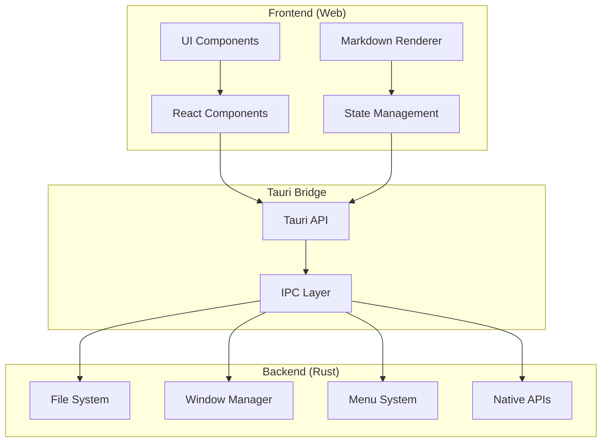
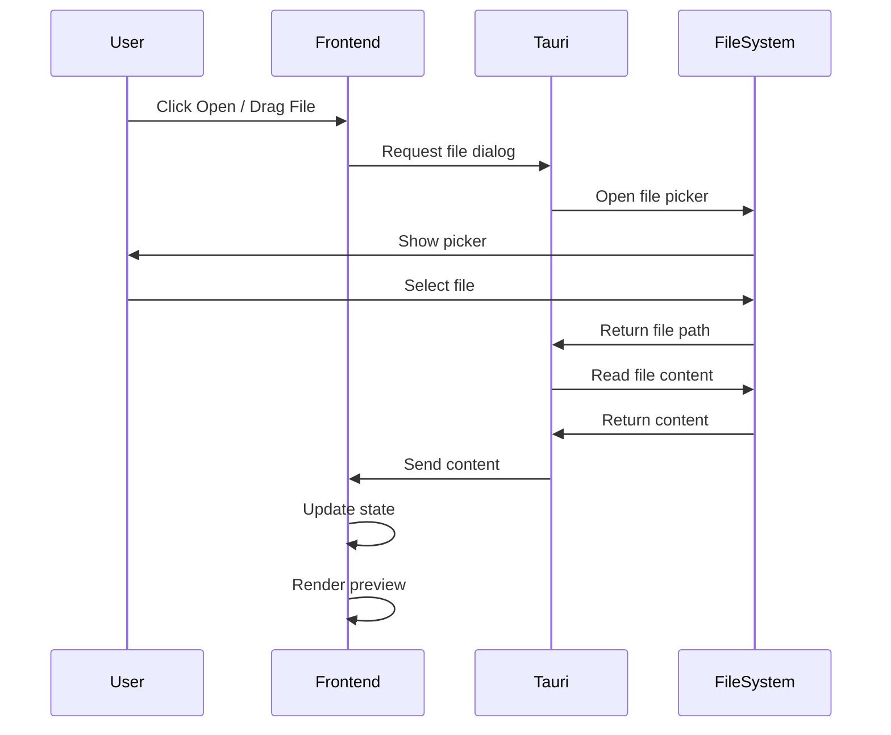
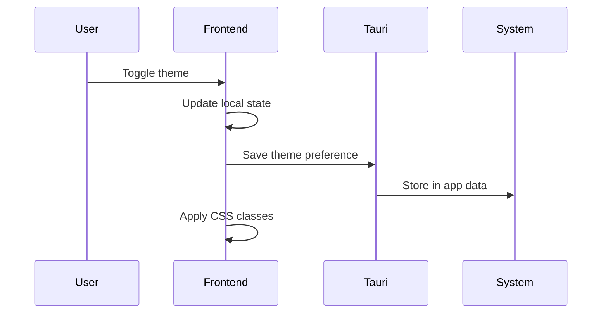
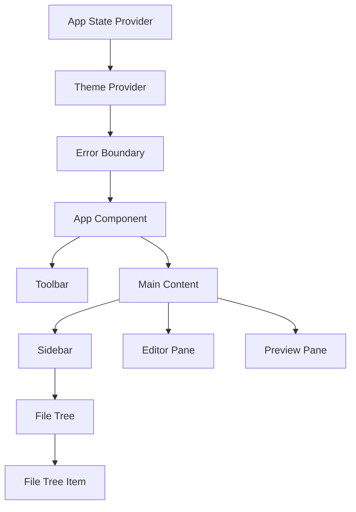
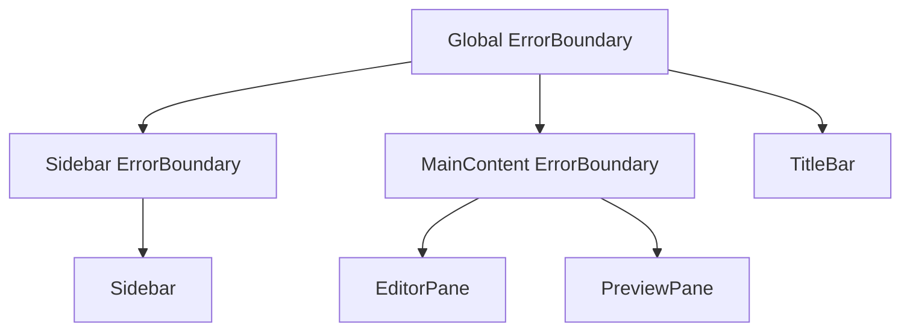
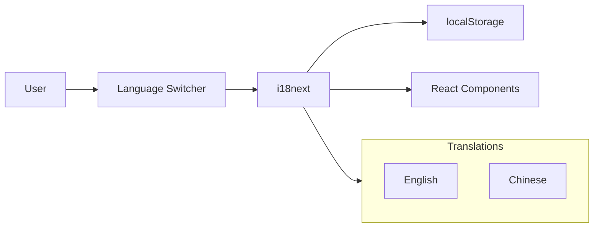

# Architecture Overview

This document provides a high-level overview of Seven MD's architecture.

## 🏗️ System Architecture

Seven MD is a desktop application built with **Tauri v2**, combining a **Rust backend** with a **React frontend**.



## 📦 Technology Stack

### Frontend

| Technology | Purpose |
|------------|---------|
| React 19 | UI framework |
| TypeScript | Type safety |
| Vite | Build tool & dev server |
| Tailwind CSS | Styling |
| ReactMarkdown | Markdown rendering |
| highlight.js | Code syntax highlighting |
| KaTeX | Math formula rendering |
| Mermaid | Diagram rendering |

### Backend

| Technology | Purpose |
|------------|---------|
| Rust | Native backend |
| Tauri v2 | Desktop framework |
| Tao | Window management |
| Wry | WebView |

## 🔄 Data Flow

### File Opening Flow



### Theme Switching Flow



## 📁 Project Structure

```
seven_md/
├── src/                      # Frontend source code
│   ├── components/           # React components
│   │   ├── CodeMirrorEditor/ # CodeMirror editor wrapper
│   │   ├── DevTools/         # Performance dashboard
│   │   ├── ErrorBoundary/    # Error boundary components
│   │   ├── FileTree/         # File tree component
│   │   ├── MenuBar/          # Menu bar components
│   │   ├── Modal/            # Modal dialogs
│   │   ├── PreviewPane/      # Preview panel
│   │   ├── Sidebar/          # Sidebar component
│   │   ├── StatusBar/        # Status bar
│   │   └── TitleBar/         # Title bar with breadcrumb
│   ├── hooks/                # Custom React hooks
│   │   ├── useAppState.ts    # App state hooks
│   │   ├── useFileOperations.ts # File operations
│   │   ├── useFileOperationTiming.ts # Timing hooks
│   │   ├── useKeyboardNavigation.ts # Keyboard nav
│   │   ├── useKeyboardShortcuts.ts # Shortcuts
│   │   ├── usePerformanceMonitor.ts # Performance
│   │   ├── useRecentFiles.ts # Recent files
│   │   └── useTheme.ts       # Theme management
│   ├── utils/                # Utility functions
│   │   ├── fileIcons.tsx     # File icon mappings
│   │   ├── inputSanitizer.ts # Input sanitization
│   │   ├── logger.ts         # Logging system
│   │   ├── loggerPersistence.ts # Log persistence
│   │   ├── memoryMonitor.ts  # Memory monitoring
│   │   ├── pathValidator.ts  # Path validation
│   │   └── persistence.ts    # State persistence
│   ├── context/              # React context providers
│   ├── reducers/             # State reducers
│   ├── types/                # TypeScript types
│   ├── locales/              # i18n translations
│   ├── i18n/                 # i18n configuration
│   ├── App.tsx               # Main app component
│   ├── main.tsx              # Entry point
│   └── index.css             # Global styles
│
├── src-tauri/                # Backend source code
│   ├── src/
│   │   ├── main.rs           # Main entry point
│   │   ├── lib.rs            # Library exports
│   │   ├── commands.rs       # Tauri commands
│   │   ├── logger.rs         # Rust logging
│   │   └── menu.rs           # Menu setup
│   ├── Cargo.toml            # Rust dependencies
│   ├── tauri.conf.json       # Tauri configuration
│   └── build.rs              # Build script
│
├── docs/                     # Documentation
│   ├── ARCHITECTURE.md       # Architecture overview
│   ├── API-REFERENCE.md      # API documentation
│   ├── USER-GUIDE.md         # User manual
│   ├── TESTING.md            # Testing guide
│   ├── DEBUGGING.md          # Debugging guide
│   └── CONTRIBUTING-CODE.md  # Contribution guide
│
├── .github/                  # GitHub configuration
│   └── workflows/            # CI/CD workflows
│
└── dist/                     # Build output
```

## 🧩 Component Architecture

### Frontend Components



### Error Boundary Architecture

The app implements multi-level error boundaries for graceful error handling:



**Error Boundary Levels:**

| Level | Scope | Recovery Options |
|-------|-------|-----------------|
| Global | Root application | Reload app |
| Sidebar | File tree navigation | Retry sidebar, close folder |
| MainContent | Editor and preview | Retry content, close file |

### Backend Modules

- **commands.rs** - Tauri command handlers
- **menu.rs** - Native menu setup
- **lib.rs** - Library exports
- **main.rs** - Application entry point
- **logger.rs** - Rust logging module

## 🔐 Security Model

### Frontend Security

- No `eval()` or `innerHTML` usage
- Sanitized Markdown rendering
- Content Security Policy (CSP) enabled
- No external network requests
- Input sanitization for all user inputs

### Security Utilities

The app includes comprehensive security utilities:

```typescript
// Path validation - prevents path traversal attacks
const result = validatePath(userInput)
if (!result.isValid) {
  // Handle invalid path
}

// Input sanitization
const clean = sanitizeHtml(userContent)
const safeUrl = sanitizeUrl(userUrl)

// Filename validation
const { isValid, error } = validateFilename(filename)
```

**Security Checks:**

| Check | Purpose |
|-------|---------|
| Path traversal detection | Prevent `../` attacks |
| Null byte injection | Prevent `\0` attacks |
| Suspicious path detection | Heuristic pattern matching |
| HTML sanitization | Remove malicious scripts |
| URL validation | Block `javascript:` URLs |

### Backend Security

- Sandboxed file system access
- Limited API surface
- No arbitrary code execution
- Code signing for releases
- Secure IPC communication

## 🚀 Performance Optimizations

### Frontend

- **Virtual DOM** - React's efficient reconciliation
- **Lazy Rendering** - Only render visible content
- **Memoization** - Cache expensive computations
- **Code Splitting** - Load code on demand
- **Performance Monitoring** - Built-in hooks for measuring render times
- **Memory Monitoring** - Track memory usage and detect leaks

### Performance Monitoring System

```typescript
// Component-level monitoring
const { metrics } = usePerformanceMonitor('MyComponent', {
  slowRenderThreshold: 16,  // 60fps
  warnOnSlowRender: true
})

// File operation timing
const { measureOperation } = useFileOperationTiming()
await measureOperation('openFile', async () => { ... })

// Memory tracking
const monitor = createMemoryMonitor({
  warningMB: 100,
  criticalMB: 200
})
```

### Backend

- **Native Performance** - Rust's zero-cost abstractions
- **Efficient IPC** - Minimal serialization overhead
- **Resource Management** - Proper cleanup and lifecycle
- **Async Operations** - Non-blocking file operations

## 🌐 Internationalization

### i18n Architecture



### Supported Languages

| Language | Code | Status |
|----------|------|--------|
| English | `en` | Complete |
| Chinese | `zh` | Complete |

### Translation Structure

```typescript
// Translation keys are organized by feature
{
  common: { ... },    // Shared strings
  menu: { ... },      // Menu items
  sidebar: { ... },   // Sidebar labels
  editor: { ... },    // Editor UI
  preview: { ... },   // Preview UI
  theme: { ... },     // Theme labels
  shortcuts: { ... }, // Shortcut descriptions
  errors: { ... },    // Error messages
  about: { ... }      // About dialog
}
```

## ♿ Accessibility

### Keyboard Navigation

The app implements comprehensive keyboard navigation:

```typescript
// Navigation hook for lists and menus
const { focusNext, focusPrevious } = useKeyboardNavigation(containerRef, {
  arrowKeys: true,
  loop: true
})

// Focus trap for modals
useFocusTrap(modalRef, {
  onEscape: closeModal,
  autoFocus: true
})

// Screen reader announcements
announceToScreenReader('File saved successfully')
```

### Accessibility Features

- **Keyboard Navigation** - Full keyboard support for all actions
- **Screen Reader Support** - ARIA labels and live announcements
- **Focus Management** - Visible focus indicators and focus traps
- **High Contrast** - Support for high contrast themes

## 📊 State Management

### Frontend State

```typescript
interface AppState {
  // Folder state
  folder: {
    path: string | null
    tree: FileTreeNode[] | null
    expandedDirs: Set<string>
  }
  
  // File state
  file: {
    path: string | null
    content: string
    isDirty: boolean
  }
  
  // UI state
  ui: {
    sidebarCollapsed: boolean
    editorCollapsed: boolean
    previewCollapsed: boolean
    theme: 'light' | 'dark'
  }
}
```

### Persistence

- Folder path and UI state stored in app data directory
- Configuration saved as JSON file
- Theme preference synced with system preferences
- Layout state (sidebar, editor, preview collapse states) persisted across sessions

## 🔧 Build Process

### Development Build

```
Vite Dev Server → Hot Module Replacement → Fast Refresh
         ↓
Tauri Development Build → Native Window with DevTools
```

### Production Build

```
Vite Build → Optimized Assets
         ↓
Tauri Build → Native Binary + WebView
         ↓
Code Signing → Notarization → DMG/APP Bundle
```

## 🧪 Testing Strategy

### Frontend Testing

- **Unit Tests** - Vitest + React Testing Library
- **Component Tests** - Test component behavior and interactions
- **Hook Tests** - Test custom hooks with renderHook
- **Integration Tests** - Test component interactions
- **Coverage** - Minimum 80% coverage requirement

### Test Structure

```
src/
├── components/
│   └── ComponentName/
│       └── ComponentName.test.tsx
├── hooks/
│   └── hookName.test.ts
└── utils/
    └── utilName.test.ts
```

### Testing Best Practices

```typescript
// Test behavior, not implementation
expect(screen.getByText('Welcome')).toBeInTheDocument()

// Use user-centric queries
await user.click(screen.getByRole('button'))

// Test error states
expect(screen.getByText('Error message')).toBeInTheDocument()
```

### Backend Testing

- **Unit Tests** - Rust's built-in test framework
- **Integration Tests** - Test command handlers
- **Property Tests** - QuickCheck for edge cases

### CI/CD Testing

All tests run automatically in GitHub Actions:

1. Frontend unit tests with coverage
2. Rust backend tests
3. Type checking (TypeScript)
4. Linting (ESLint + Clippy)
5. Coverage reporting to Codecov

## 🗂️ Tab State Management

Seven MD supports multi-tab editing. The tab system is built on top of the existing `AppContext` state management.

### Tab State Shape

```typescript
interface TabsState {
  tabs: TabState[]          // All open tabs
  activeTabId: string | null
  recentlyClosed: TabState[] // Up to 10 recently closed tabs
}

interface TabState {
  id: string                // Unique tab ID (UUID)
  path: string | null       // File path (null for untitled)
  content: string           // Current editor content
  isDirty: boolean          // Has unsaved changes
  cursorPosition: { line: number; column: number }
  scrollPosition: { line: number }
  lastAccessed: number      // Timestamp for LRU eviction
}
```

### Tab Actions (Reducer)

| Action | Description |
|--------|-------------|
| `OPEN_TAB` | Open file in new tab (or switch to existing) |
| `CLOSE_TAB` | Close tab, add to recentlyClosed |
| `SWITCH_TAB` | Activate a different tab |
| `REORDER_TABS` | Drag-and-drop reordering |
| `CLOSE_ALL_TABS` | Close all open tabs |
| `CLOSE_OTHER_TABS` | Close all except specified tab |
| `CLOSE_TABS_TO_RIGHT` | Close tabs to the right |
| `REOPEN_CLOSED_TAB` | Restore last closed tab |
| `CLEAR_RECENTLY_CLOSED` | Clear tab history |
| `UPDATE_TAB_CONTENT` | Update content, mark dirty |
| `SET_TAB_DIRTY` | Set dirty flag |
| `UPDATE_TAB_CURSOR` | Update cursor position |
| `RESTORE_TABS` | Restore tabs from persistence |

### Tab Persistence

Tab state is persisted separately from UI state in `{appDataDir}/tabs.json`:

- **Dirty tabs**: Full content is persisted
- **Clean tabs**: Only path is persisted; content reloaded from disk on restore
- **Cursor/scroll positions**: Always persisted
- **Autosave**: Every 5 minutes via `startTabAutosave()`
- **Debounced save**: 500ms after any tab change

### LRU Eviction

When the tab count approaches 40 (warning threshold), clean tabs are evicted by LRU order. The hard limit is 50 tabs.

### Key Files

| File | Purpose |
|------|---------|
| `src/reducers/appReducer.ts` | Tab action handlers |
| `src/hooks/useTabManagement.ts` | Tab management hook |
| `src/utils/tabUtils.ts` | Tab utility functions |
| `src/utils/tabPersistence.ts` | Tab persistence utilities |
| `src/components/TabBar/` | Tab bar UI component |
| `src/components/DirtyTabDialog.tsx` | Unsaved changes dialog |

---

## 🔮 Future Architecture

Potential improvements:

1. **Plugin System** - Support for third-party extensions
2. **Cloud Sync** - Optional cloud synchronization
3. **Collaboration** - Real-time collaborative editing
4. **Performance** - Virtual scrolling for large files

## 📚 References

- [Tauri Architecture](https://tauri.app/v2/guides/architecture/)
- [React Architecture](https://react.dev/learn/thinking-in-react)
- [Rust Patterns](https://rust-unofficial.github.io/patterns/)
